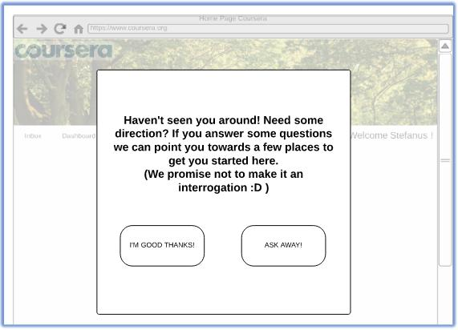
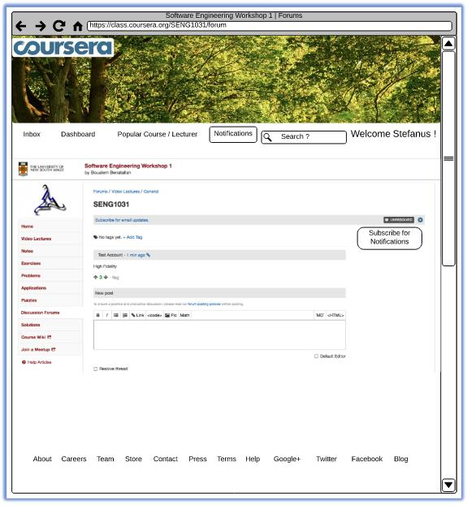
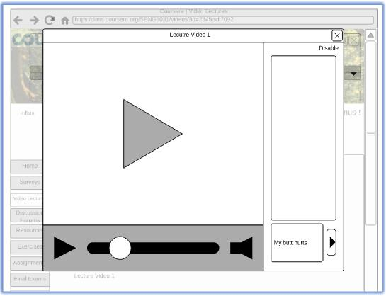
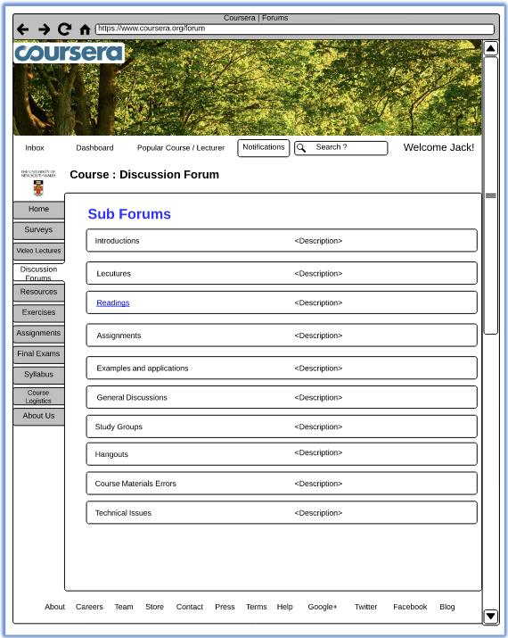

# Part 4. High-Fidelity Prototype

In contrast, to low-Fidelity prototypes, high-FI prototypes use more advanced 
(often electronic) techniques for illustratively describing the prototype. 
Albeit, the methodology remains the same, with respect to: Storyboard interactions; 
UI Component sketches; and finally combing the above altogether.

High-fidelity prototypesusually allowrealistic (mouse-keyboard) user 
interactions. High-fidelity prototypes take you as close as possible to a 
true representation of the user interface. 

High-fidelity prototypes are assumed to be much more effective in collecting 
true human performance data (e.g., time to complete a task), and in 
demonstrating actual products to clients, management, and others.

High-FI UI prototypes could be developed usingwireframe tools 
(e.g., Axure, Luicid charts,Moqups...etc.) or using HTML/CSS/JS which require 
skills in code developments. We recommend for this deliverable to rely on 
HTML/CSS/JS fordeveloping your High-FI UI prototype so that you can reuse parts 
of the code when building your functional prototype later on.

For purpose of example, the following are a small variety of sample screen 
layouts from previous years’ students:

