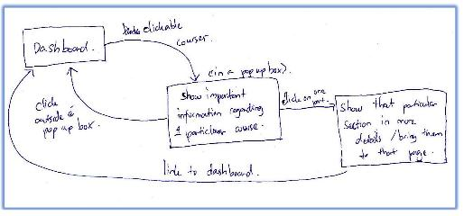
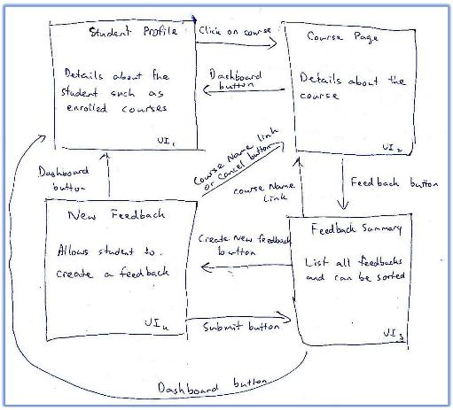
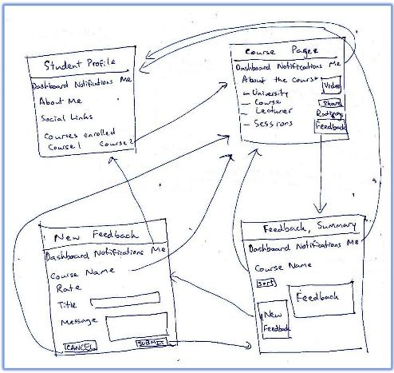

# Part 3. Low-Fidelity Prototype

A Low-FI UI prototype often involves whiteboard and/or paper-pen sketching
of the UI components. The purpose is to have an easy way to iterate over 
the design elements, without having to spend too much time and effort to redesign, 
when fast-paced changes are needed. 

There are several aspects/dimensions in order to accomplish Lo-FI prototypes:

## 1. Storyboard Interactions Graphs: 

The concept of a storyboard has been borrowed from filmmakers, 
whereby it is usually utilised for illustratively describing the sequence 
of scenes (called a ‘script’) in order to focus on interactions not scene details. 
Likewise, storyboards in prototyping serves to illustratively describe the 
features of the system, while demonstrating the interactions between actors. 
This helps present the transitions between UI components for others to understand, 
especially given a complex UI involving several UI components. A UI storyboard 
is often expressed using nodes and trees/graphs of UI screens 
(use cases involve sequences, decision points, alternative flows, etc.).

To be used as a guide only, the following shows some examples 
from previous years’ students work:

## 2.UI Component Sketches: 

As noted above, the first part of this deliverable will be definedand design 
the “big picture” storyboard, as shown above. This makes it easier to see and 
understand the overall interactions, without clouding with detail. The next step 
will be to define the detailed UI component sketches for each UI component. 
The purpose of this is to give the practitioner who is reading the prototype 
context about the specific UI elements that are involved in the interactions.

The UI component sketches referred to in this part, could either be presented 
as a stand-alone, (often in cases which explicit detail is required). 
However, it could also be combined in part (3) of this deliverable, 
as shown in the examples below!

## 3. Storyboard Interactions + UI Component Sketches: 

Therefore, in order to present the complete picture, showing both 
interactions between the components and the UI elements involved in the 
interactions... the storyboard is combined with the UI component sketches to 
create a more complete storyboard.

Again, for your convenience, and to be used as a guide only, 
the following are some examples from previous years’ students work:

