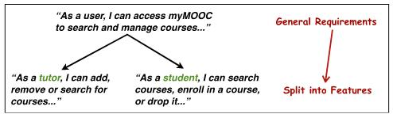
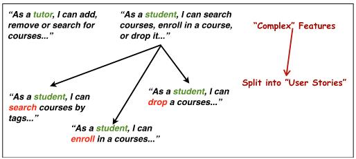

# Part 2: Identify and Describe User Stories

Identify high level requirements (i.e. features) based on the problem statement 
you have specified inPart 1 of the deliverable. The following is a summarised 
“working example” to be used a guidance in helping you prepare your submission:

 

The above starts with a general “requirement” (obtained from your 
problem statements. This is then decomposed into a “set of features” 
(where applicable). In this case, “people” are generic, which could be 
refined into two main categories of people, namely: Students and Tutors.

Subsequently, feature themselves may often be “complex”, in which case they 
can be further split.

Notation for Describing a Feature:Based on “ConnextraNotation” 
(refer to Lecture notes for more details). 
Search Tutor by reputationscore
Also recall SMART guidelines for effective presentation.

# !NOTE!

“effective presentation”mainly means the presented user-stories should be 
(somewhat informally) evaluated by applying and verifyingthe SMART 
guidelines (at least with respect to: Specific, Measurable, and Relevant). 
The other dimensions ofAchievable andTime-boxed are certainly nonetheless 
important, albeit will be discussed more succinctly during mentors’ meetings, 
whereas the purpose of this deliverable is to focus your attention on the three 
dimensions mentioned above.

Finally, each finest-grained feature may then be expressed as “user-stories”. 
As mentioned, a user-story captures both: Description of the Feature + Description 
of a potential Scenario.Notation for Describing a Scenario:As a way for 
illustrating a single feature; often consists of 6-8 steps. Such as: 
GIVEN, WHEN, THEN, AND, ... Note, this syntax can iterate, (e.g. GIVEN, WHEN, THEN, WHEN, THEN, etc.)

Putting it all together:

`====================================================================`

**Feature:** Search Tutor by reputationi score
**As a** Student 

**So that** I can find a qualified tutor. 

**Scenario** Search Tutors by reputation 
(cloud can be used to generate UI interactions/mock-ups...) 

**GIVEN** I am on myMOOC home page
**WHEN** I click on “look for a Tutor"
**THEN** I should be on “Look for a Tutor” page
**WHEN** I fill in “reputation’’ higher than” “0.9”
**AND** I press “Search” button
**THEN** I see all Tutors having reputation score higher than 0.9

`====================================================================`

